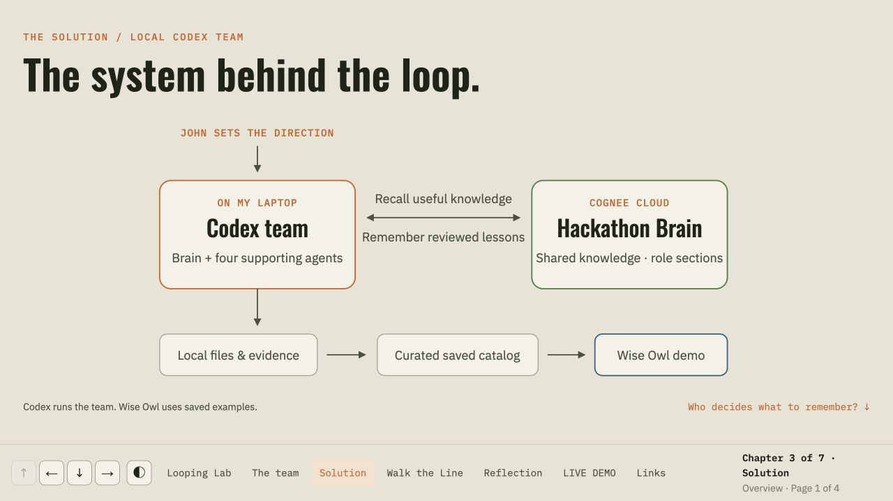

# The Looping Lab

**One lab. Every hackathon, another loop.**

The Looping Lab is a human-led hackathon learning system: **ideation → build → review → reuse**. Each event is an experiment in running the full software development lifecycle. The aim is to arrive with the laptop, methods, and context ready, choose the next idea, and say: “Go build it, factory.”

Built for **Battle of the Personal Brains**, September 21, 2026.

- **[Open the presentation](https://milbird-three-layers-sep26.john821249.chatgpt.site/#story)** — Left/Right advances the story; Down opens the evidence and detail.
- **[Ask Wise Owl](https://milbird-three-layers-sep26.john821249.chatgpt.site/scope-goblin/)** — your hackathon advisor: know what we tried; choose what to try next.
- **[Explore Milbird’s hackathon history](https://milbird.com/hackathons/)** — the broader series of projects and experiments.

## What we built

A shared Cognee brain carries hackathon methods and selected project context into a human-directed team in Codex. John directs the Brain co-pilot. The Participant, Sponsor, Assess Hackathon, and Join New Hackathon roles work with that shared context, each bringing a different perspective. John remains the decision owner.

The presentation has seven horizontal chapters: **Looping Lab → Team → Solution → Walk the Line → Reflection → LIVE DEMO → Links**. The Team shows agent communication around a round table and shared Cognee memory. Solution makes the architecture and human-reviewed memory selection visible. Supporting detail sits below each chapter.

**Wise Owl — your hackathon advisor** is the working artifact built by the Participant. **Know what we tried. Choose what to try next.** It starts with a blank answer panel and a question. After you choose **Ask Wise Owl**, it matches the question to one of four source-qualified saved records, explains what is known, and suggests when to reuse a lesson or challenge a rule with an observable experiment. Editing the question clears the previous answer.

The catalog covers working together, choosing scope, claims and evidence, and reviewing a result. It distinguishes personal accounts and reported outcomes from operating methods and authored proposals. A question outside the catalog gets an explicit missing-evidence response. The entire hackathon history is not loaded.

## Screenshots

Captured from the running presentation:

| The learning loop | The agent team |
| --- | --- |
|  |  |
| Reflection | Live demo |
|  |  |




## Architecture


The project’s Cognee dataset is `hackathon-prep`, in the `hackathon machine` workspace. Role-specific node sets organize shared, participant, sponsor, and assessment context. They are retrieval filters, not separate security boundaries. Memory is selected and reviewed before ingestion; the previous Walk the Line corpus has not been ingested.

The agents run in local Codex tasks. Cognee memory is hosted on Cognee Cloud. The public presentation and browser advisor are static pages; they do not carry API keys or call the private brain. Wise Owl uses deterministic matching against four curated saved records. It does not make live model or Cognee calls. AWS, Strands, Docker Sandboxes, and Bright Data were discussed but are not part of the delivered demo. An ordinary Docker version of Wise Owl is included.

See [the architecture notes](docs/architecture.md), [the curated catalog](scope-goblin/lesson.json), [Wise Owl local verification](scope-goblin/wise-owl-verification.json), and [the published round-trip check](scope-goblin/wise-owl-public-verification.json). The `scope-goblin/` source folder and public URL remain for compatibility with the original demo. `DEVPOST.md` and the earlier verification receipts are retained as historical submission records.

## Run the presentation and browser demo locally

Python 3 is sufficient; there is no package install or build step.

```sh
python3 -m http.server 4173 --bind 127.0.0.1 --directory presentation
```

Open [the presentation](http://127.0.0.1:4173/) or [Wise Owl](http://127.0.0.1:4173/scope-goblin/).

To regenerate the standalone advisor after editing its source:

```sh
python3 -B scope-goblin/build-portable.py
cp scope-goblin/portable/index.html presentation/scope-goblin/index.html
```

## Edit the presentation source

The reusable event content and templates are in [`presentation/content/`](presentation/content/); the renderer is in [`presentation/scripts/`](presentation/scripts/). This public export keeps the static files directly under `presentation/`, so the renderer’s output path is adapted to that layout.

```sh
python3 presentation/scripts/render-event-readouts.py
```

The snapshot corresponds to Sites source commit `97ca9401875321c8d8a9b633b4a8eaa3406e5bca` (v18).

## Run Wise Owl in Docker

```sh
cd scope-goblin
docker build -t looping-lab-scope-goblin:local .
docker run --rm --name looping-lab-scope-goblin --read-only --cap-drop ALL --security-opt no-new-privileges --memory 64m --cpus 0.5 -p 127.0.0.1:8793:8080 looping-lab-scope-goblin:local
```

Open [the container edition](http://127.0.0.1:8793/). The container uses only Python’s standard library, runs as a non-root user, and does not store questions.

## A one-minute demo

1. Open Wise Owl: the answer panel starts blank.
2. Choose **Working together**. The example fills the question without generating an answer.
3. Choose **Ask Wise Owl**. Inspect the personal account, its limits, reuse conditions, proposed experiment, and source.
4. Try **Choosing scope**: the saved method has no recorded comparative outcome, and a wider connected test may be the right choice.
5. Ask about a project or technology absent from the catalog. Wise Owl says it lacks the evidence.
6. Choose **Keep this decision plan** for a copyable record, or **Back to the presentation** to return to LIVE DEMO.

## Verification and scope

Run the repeatable advisor check with Python 3 and Node:

```sh
python3 -B scope-goblin/verify-wise-owl.py
```

The current Wise Owl receipt records nine Python/browser parity and routing cases, invalid-input checks, four distinct themes, a blank initial answer, no answer from merely selecting an example, clearing stale advice on edit, an explicit unknown response, a complete copyable decision plan, local Docker checks, and return navigation. See `scope-goblin/wise-owl-verification.json` for the exact verification scope. The published v15 round-trip check separately verified same-tab entry, blank initial output, a qualified collaboration answer, a complete decision plan, return to LIVE DEMO, and arrow navigation afterward; see `scope-goblin/wise-owl-public-verification.json`.

The preceding Scope Goblin and Focus Owl receipts remain unchanged. They describe their historical builds, including the v14 public navigation check; they do not establish current advisor behavior. These checks are preparer verification, not independent assessment or evidence of improved hackathon outcomes.

This repository is the public project snapshot: runnable advisor code, the public presentation, screenshots, and documentation. It excludes API keys, local credential files, private memory corpora, and private interview transcripts. The catalog includes two existing curated methods and two approved public presentation excerpts. No original Walk the Line source was loaded or ingested for this advisor. The historical preparation repository remains private. No video recording is included yet.

## Credits

Created by John Miller / [Milbird](https://milbird.com/) with a human-directed Codex agent team and Cognee memory. The team communication graph illustrates roles and shared context; it is not a live activity monitor. Earlier generated team illustrations are retained as historical assets. See [visual credits](docs/visual-credits.md) for image provenance and the Rodin photograph’s CC BY-SA 3.0 attribution.
