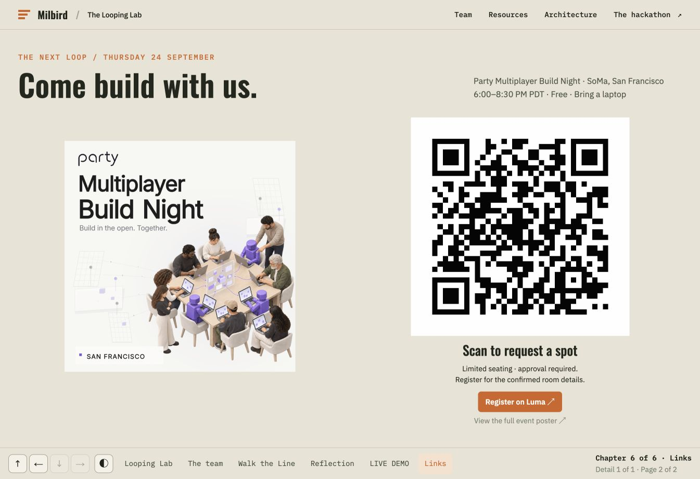
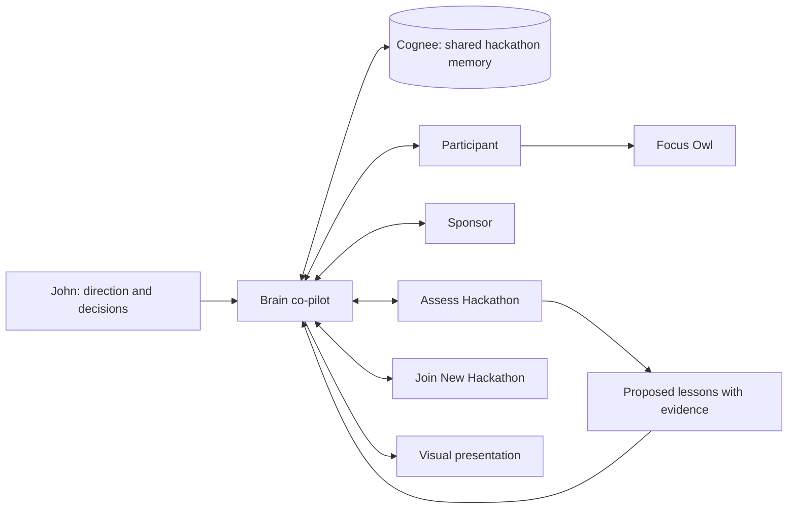

# The Looping Lab

**One lab. Every hackathon, another loop.**

The Looping Lab is a human-led hackathon learning system: **ideation → build → review → reuse**. Each event is an experiment in running the full software development lifecycle. The aim is to arrive with the laptop, methods, and context ready, choose the next idea, and say: “Go build it, factory.”

Built for **Battle of the Personal Brains**, September 21, 2026.

- **[Open the presentation](https://milbird-three-layers-sep26.john821249.chatgpt.site/#story)** — Left/Right advances the story; Down opens the evidence and detail.
- **[Try Focus Owl](https://milbird-three-layers-sep26.john821249.chatgpt.site/scope-goblin/)** — turn an overambitious pitch into a small, checkable next step.
- **[Explore Milbird’s hackathon history](https://milbird.com/hackathons/)** — the broader series of projects and experiments.

## What we built

A shared Cognee brain carries hackathon methods and selected project context into a human-directed team in Codex. John directs the Brain co-pilot. The Participant, Sponsor, Assess Hackathon, and Join New Hackathon roles work with that shared context, each bringing a different perspective. John remains the decision owner.

The presentation tells the learning loop visually: the lab, the team around a round table, the previous Walk the Line build, reflection, the live demo, and the next event. Details and evidence sit below each chapter.

**Focus Owl** is the small working artifact built by the Participant. **Turn a big idea into one small thing you can finish.** It uses a saved Brain method—build the smallest runnable slice and check observable behavior—to turn a pitch into one small next action, a visible definition of done, and extras to park for later. It can reveal a copyable plan containing its source and verification status.

## Screenshots

Captured from the running presentation:

| The learning loop | The agent team |
| --- | --- |
|  |  |
| Reflection | Live demo |
|  |  |



## Architecture



The project’s Cognee dataset is `hackathon-prep`, in the `hackathon machine` workspace. Role-specific node sets organize shared, participant, sponsor, and assessment context. They are retrieval filters, not separate security boundaries. Memory is selected and reviewed before ingestion; the previous Walk the Line corpus has not been ingested.

The agents run in local Codex tasks. Cognee memory is hosted on Cognee Cloud. The public presentation and browser game are static pages; they do not carry API keys or call the private brain. The game uses deterministic rules and a curated saved method, not a live language model. AWS, Strands, Docker Sandboxes, and Bright Data were discussed but are not part of the delivered demo. An ordinary Docker version of Focus Owl is included.

See [the architecture notes](docs/architecture.md), [Focus Owl engine/flow verification](scope-goblin/focus-owl-verification.json), and [latest public navigation verification](scope-goblin/navigation-verification.json). The `scope-goblin/` source folder and public URL remain for compatibility with the original demo.

## Run the presentation and browser demo locally

Python 3 is sufficient; there is no package install or build step.

```sh
python3 -m http.server 4173 --bind 127.0.0.1 --directory presentation
```

Open [the presentation](http://127.0.0.1:4173/) or [Focus Owl](http://127.0.0.1:4173/scope-goblin/).

To regenerate the standalone game after editing its source:

```sh
python3 -B scope-goblin/build-portable.py
cp scope-goblin/portable/index.html presentation/scope-goblin/index.html
```

## Edit the presentation source

The reusable event content and templates are in [`presentation/content/`](presentation/content/); the renderer is in [`presentation/scripts/`](presentation/scripts/). This public export keeps the static files directly under `presentation/`, so the renderer’s output path is adapted to that layout.

```sh
python3 presentation/scripts/render-event-readouts.py
```

The snapshot corresponds to Sites source commit `30d02c230f146afbffc51f5394fdc02568d98242` (v14).

## Run Focus Owl in Docker

```sh
cd scope-goblin
docker build -t looping-lab-scope-goblin:local .
docker run --rm --name looping-lab-scope-goblin --read-only --cap-drop ALL --security-opt no-new-privileges --memory 64m --cpus 0.5 -p 127.0.0.1:8793:8080 looping-lab-scope-goblin:local
```

Open [the container edition](http://127.0.0.1:8793/). The container uses only Python’s standard library, runs as a non-root user, and does not store pitches.

## A 30-second demo

1. Open Focus Owl and choose **Pizza empire**.
2. Choose **Find my focus**: “Big wings. Small first flight.”
3. Show the single dinner-picker action, what “done” looks like, and extras parked for later.
4. Choose **Keep my focus plan** to reveal the source-linked Markdown plan.
5. Use **Back to presentation** to return to LIVE DEMO, then press Right for the final links. The deck opens the game in the same tab so this round trip works in the in-app browser.

## Verification and scope

The original Scope Goblin implementation was checked in a local Docker container and browser, including invalid input and a 390px viewport; its original receipts are retained unchanged. The Focus Owl update passed eight Python/browser parity cases, the pizza-to-focus-plan browser flow, and local container checks. A subsequent public Site v14 check verified the deck → game → presentation round trip, the focus plan, and arrow navigation after return. See `scope-goblin/focus-owl-verification.json` and `scope-goblin/navigation-verification.json`. These are preparer checks, not independent assessment or a demonstrated improvement in future outcomes.

This repository is the public submission snapshot: runnable demo code, the public presentation, screenshots, and documentation. It excludes API keys, local credential files, private memory corpora, and private interview transcripts. The historical preparation repository remains private. No video recording is included yet.

## Credits

Created by John Miller / [Milbird](https://milbird.com/) with a human-directed Codex agent team and Cognee memory. The team illustration is an illustrative scene rather than a transcript of live agent activity. See [visual credits](docs/visual-credits.md) for image provenance and the Rodin photograph’s CC BY-SA 3.0 attribution.
